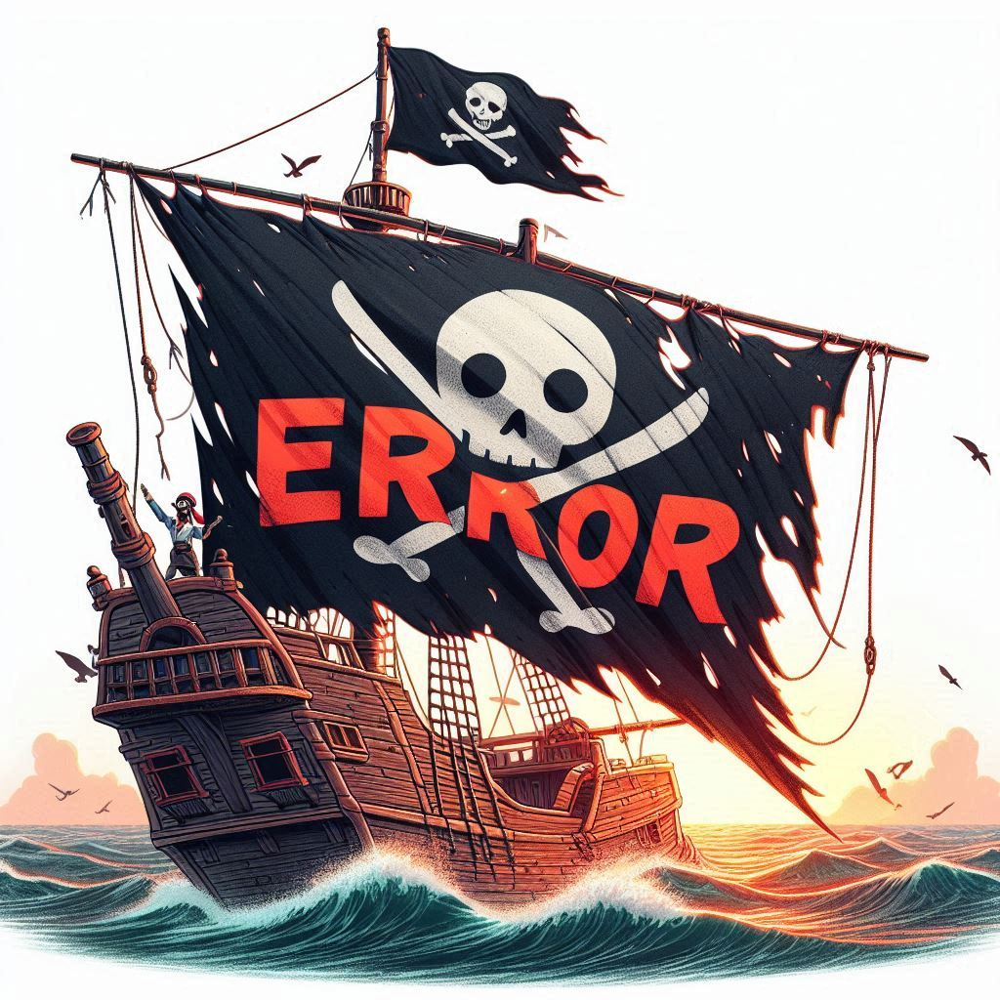
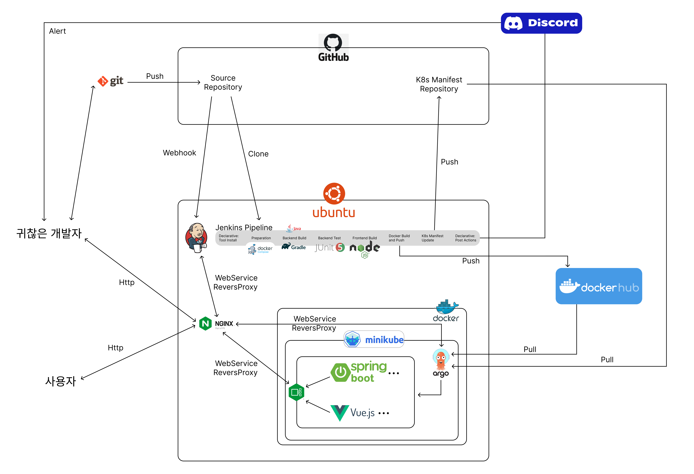
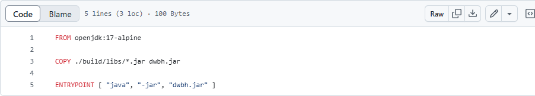
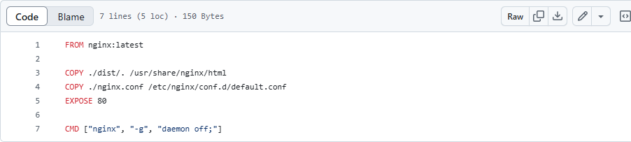
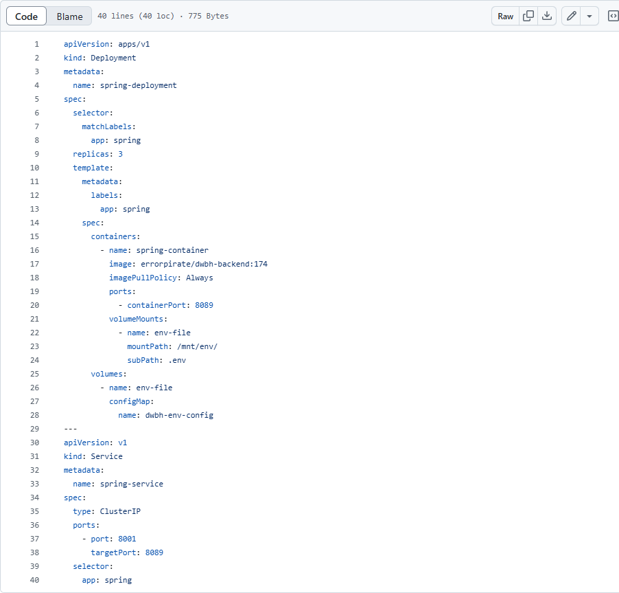
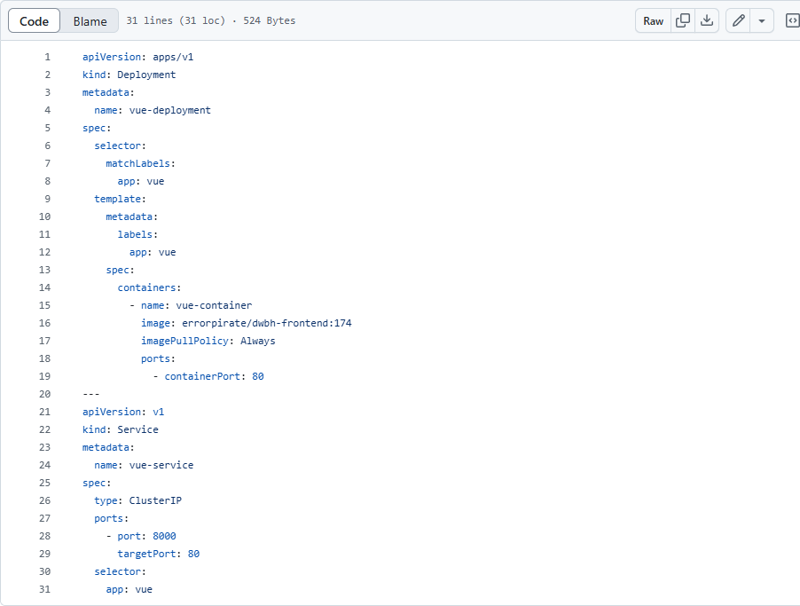
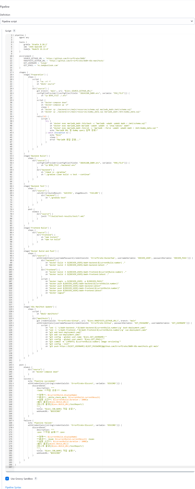

<table>
 <tr>
    <td align="center"><a href="https://github.com/hcbak"></a></td>
    <td align="center"><a href="https://github.com/beanteacher"></a></td>
    <td align="center"><a href="https://github.com/dispear"></a></td>
    <td align="center"><a href="https://github.com/sung-mini"></a></td>
    <td align="center"><a href="https://github.com/catnine11"></a></td>
    <td align="center"><a href="https://github.com/AYeong-Jeon"></a></td>
  </tr>
  <tr>
    <td align="center"><a href="https://github.com/hcbak"><b>박희찬</b></a></td>
    <td align="center"><a href="https://github.com/beanteacher"><b>오민성</b></a></td>
    <td align="center"><a href="https://github.com/dispear"><b>박지훈</b></a></td>
    <td align="center"><a href="https://github.com/sung-mini"><b>이성민</b></a></td>
    <td align="center"><a href="https://github.com/catnine11"><b>남가람</b></a></td>
    <td align="center"><a href="https://github.com/AYeong-Jeon"><b>전아영</b></a></td>
  </tr>
</table>

<br>

# DWBH
Don't worry be happy
<div style="text-align: center;">
  
</div>
## 💻프로젝트 소개

[ DWBH ]는 사용자의 성향에 맞춘 공감 방식을 추천하여 개인화된 상담 경험을 제공하는 서비스입니다. 사용자가 자신의 고민을 자유롭게 나누고, 다른 사용자들로부터 다양한 조언과 위로를 받을 수 있도록 돕는 서비스입니다. 익명으로 고민을 작성하거나 상담을 요청할 수 있으며, 다른 사용자들은 각자의 경험과 관점을 바탕으로 조언을 제공할 수 있습니다. 특히 MBTI와 감정 분석을 통해 사용자가 가장 편안하게 느낄 수 있는 공감 방법을 추천함으로써, 보다 효과적이고 만족스러운 상담을 경험할 수 있습니다.

<br>

## 📰프로젝트 필요성
고민 상담 프로젝트의 필요성은 현대인들이 겪는 다양한 스트레스와 고민을 해소하고, 개인화된 공감을 통해 심리적 안정감을 제공하는 데 있습니다. 구체적으로 다음과 같은 필요성이 있습니다:

1. 개인화된 공감의 필요성

   •	사람마다 원하는 상담 방식과 공감의 형태는 다릅니다. MBTI와 같은 성향 분석을 통해 사용자에게 적합한 공감 방식을 추천하면, 사용자는 자신에게 맞는 방식으로 위로와 조언을 받으면서 더 큰 만족감을 느낄 수 있습니다. 이는 상담의 효과를 극대화하여 더 깊은 정서적 안정감을 제공합니다.

2. 사회적 고립과 외로움 완화

   •	사회적 고립과 외로움은 현대인의 큰 문제 중 하나입니다. 사람들이 서로의 고민에 공감하고 지지하는 과정을 통해, 이 프로젝트는 사용자들이 소속감을 느끼고 관계를 형성하는 기회를 제공합니다. 다양한 사람들과 고민을 나누는 과정을 통해 정서적 연결을 느끼고, 서로에게 긍정적인 영향을 줄 수 있습니다.

3. 쉽고 간편한 접근성

   •	전문적인 상담을 받기 어려운 사람들을 위한 대안이 될 수 있습니다. 시간적, 경제적 제약 때문에 상담을 받기 어려운 사람들에게, 익명성과 안전한 환경을 제공하여 사용자가 자신의 고민을 자유롭게 표현하고 도움을 받을 수 있는 장을 마련합니다.

이처럼 고민 상담 프로젝트는 사람들이 보다 쉽게 공감을 느끼고, 자신에게 맞는 위로와 조언을 통해 심리적 안정과 소속감을 찾을 수 있는 중요한 역할을 합니다.
<br/> <br>

## 📅 개발 환경

<table>
<tr>
    <td>백엔드</td>
    <td>


    </td>
  </tr>
<tr>
    <td>프론트</td>
    <td>


    </td>
</tr>
<tr>
    <td>DB</td>
    <td>
      
          
    </td>
  </tr>
<tr>
    <td>기타</td>
    <td>
        
        
        
        
    </td>
  </tr>
</table>

<br />

## 📍주요기능
- 회원 (상담 신청자)
  - 상담사 구인글 신청
  - 상담 신청


- 회원 (상담사)
  - 개인 성향에 따른 응답 추천
<br/>

## 📄 프로젝트 문서

|     이름      |                                                                    문제 링크                                                                     |
|:-----------:|:--------------------------------------------------------------------------------------------------------------------------------------------:|
|  요구사항 명세서   |             https://docs.google.com/spreadsheets/d/1ALXvulDzo1pou0lTiANi6GzBr-wW_-c4NstQK4-6Z7w/edit?gid=841155834#gid=841155834             |
| DDD 이벤트 스토밍 |                                                   https://miro.com/app/board/uXjVLNZHXbI=/                                                   |
|   ERD 설계서   |                                                 https://www.erdcloud.com/d/C66RF8nsCa2tZ83FL                                                 |
|   기능 명세서    |          https://docs.google.com/spreadsheets/d/1ALXvulDzo1pou0lTiANi6GzBr-wW_-c4NstQK4-6Z7w/edit?pli=1&gid=841155834#gid=841155834          |
|   화면 설계서    |                 https://www.figma.com/design/7bbjmO0vc6kMm5enMABC3L/에러-해적단?node-id=0-1&node-type=canvas&t=uglb6kVNMCovkcNY-0                 |

<br/>

## DevOps 산출물

### 프로젝트 아키텍처 그림



### 빌드 및 배포 문서

#### Docker 문서
<details>
  <summary> Backend </summary>



</details>
<details>
  <summary> Frontend </summary>



</details>

#### Kubernetes manifest 문서
<details>
  <summary> Ingress </summary>


</details>
<details>
  <summary> Boot Deployment </summary>



</details>
<details>
  <summary> Vue Deployment </summary>



</details>

#### Jenkins Pipeline Script 문서
<details>
  <summary> Jenkins Pipeline Script </summary>



</details>

### Jenkins CI/CD 테스트 결과 화면(GIF)

<details>
  <summary> Jenkins Pipeline Script </summary>


</details>
<details>
  <summary> Discord Bot </summary>


</details>


## 📌 프로젝트 시연

### 게스트
<details>
  <summary> 메인 화면 </summary>
  
</details>

<details>
  <summary> 회원 가입 </summary>
  
</details>

---
### 회원
<details>
  <summary> 로그인 </summary>
  
</details>

<details>
  <summary> 회원탈퇴 </summary>
  
</details>
<details>
  <summary> 회원 정보 수정 </summary>
  
</details>
<details>
  <summary> 마이페이지 </summary>
  
</details>

---
### 상담 게시판 
<details>
  <summary> 상담사 구인글 등록 정보 수정 </summary>
  
</details>
<details>
  <summary> 상담사 구인글 목록조회 </summary>
  
</details>
<details>
  <summary> 상담사 구인글 상세조회 </summary>
  
</details>
<details>
  <summary> 상담사 구인글 수정 </summary>
  
</details>
<details>
  <summary> 상담사 구인글 삭제 </summary>
  
</details>

---
### 게시글(게시판) 댓글
<details>
  <summary> 상담사 구인글 상담 제안 등록 </summary>
  
</details>
<details>
  <summary> 상담사 구인글 상담 제안 조회 </summary>
  
</details>
<details>
  <summary> 상담사 구인글 상담 제안 등록 </summary>
  
</details>
<details>
  <summary> 상담사 구인글 상담 제안 등록 </summary>
  
</details>

---
### 채팅방
<details>
  <summary> 채팅방 생성 </summary>
  
</details>
<details>
  <summary> 채팅방 목록 조회 </summary>
  
</details>
<details>
  <summary> 채팅방 종료 </summary>
  
</details>
<details>
  <summary> 채팅 참가자 상세 조회 </summary>
  
</details>
<details>
  <summary> 채팅 메세지 작성 </summary>
  
</details>
<details>
  <summary> 채팅 메세지 수정 </summary>
  
</details>
<details>
  <summary> 채팅 메세지 조회 </summary>
  
</details>

---
### 채팅 추천
<details>
  <summary> 채팅 추천 </summary>
  
</details>  
<details>
  <summary> 추천 채팅 작성 </summary>
  
</details> 
<details>
  <summary> 추천 채팅 수정 </summary>
  
</details>
<details>
  <summary> 추천 채팅 삭제 </summary>
  
</details>
<details>
  <summary> 평가 완료 후 온도 수정 </summary>
  
</details>

---
### 알림
<details>
  <summary> 알림 메세지 발송 </summary>
  
</details>
<details>
  <summary> 알림 메세지 확인 </summary>
  
</details>
<details>
  <summary> 알림 메세지 삭제 </summary>
  
</details>

---
<br />

## 📄 프로젝트 회고

| 이름  |        회고       |
|:---:|:-------------:|
| 박희찬 |                                                                                                                                                                                                                                                                                                                                                                                                                    |
| 박지훈 |         |
| 이성민 |                                                                                                                                                                                  |
| 남가람 |                            |
| 오민성 |         |
| 전아영 |         |

<br />

---
## 📌프로젝트 규칙

* 필드(카멜표기법) - 명사로 명명, 도메인 + 필드명
  ex) User클래스 userId, userName

* 메소드(카멜표기법) - 동사로 명명, 메소드명으로 기능 파악 가능하게 작성
  ex) 회원가입 joinUser

* 클래스명(파스칼표기법) - 도메인명, 도메인명+(controller, service, repository …)
  ex) UserController

* 엔드포인트 - api/v1 으로 시작

* xml 파일 위치 resources/mapper/기능/기능.xml

* 패키지명 service, dto, controller, entity, mapper

* SQL 작성 : *은 사용하지 않는다.

* SELECT, JOIN, WHERE 같이 예약어는 대문자, 나머진 소문자로 작성


<br />

## ⚠️ 권장  commit 컨벤션

```
git commit -m "feat: README.me 추가"
```
`feat` : 새로운 기능 추가 <br>
`bug` : 버그 수정 <br>
`docs` : 문서 수정 <br>
`refactor` : 코드 리팩토링 <br>
`test` : 테스트 코드, 리팩토링 테스트 코드 추가 <br>
`chore` : 빌드 업무 수정, 패키지 매니저 수정, 자잘한 수정 <br>

<br/>

---


